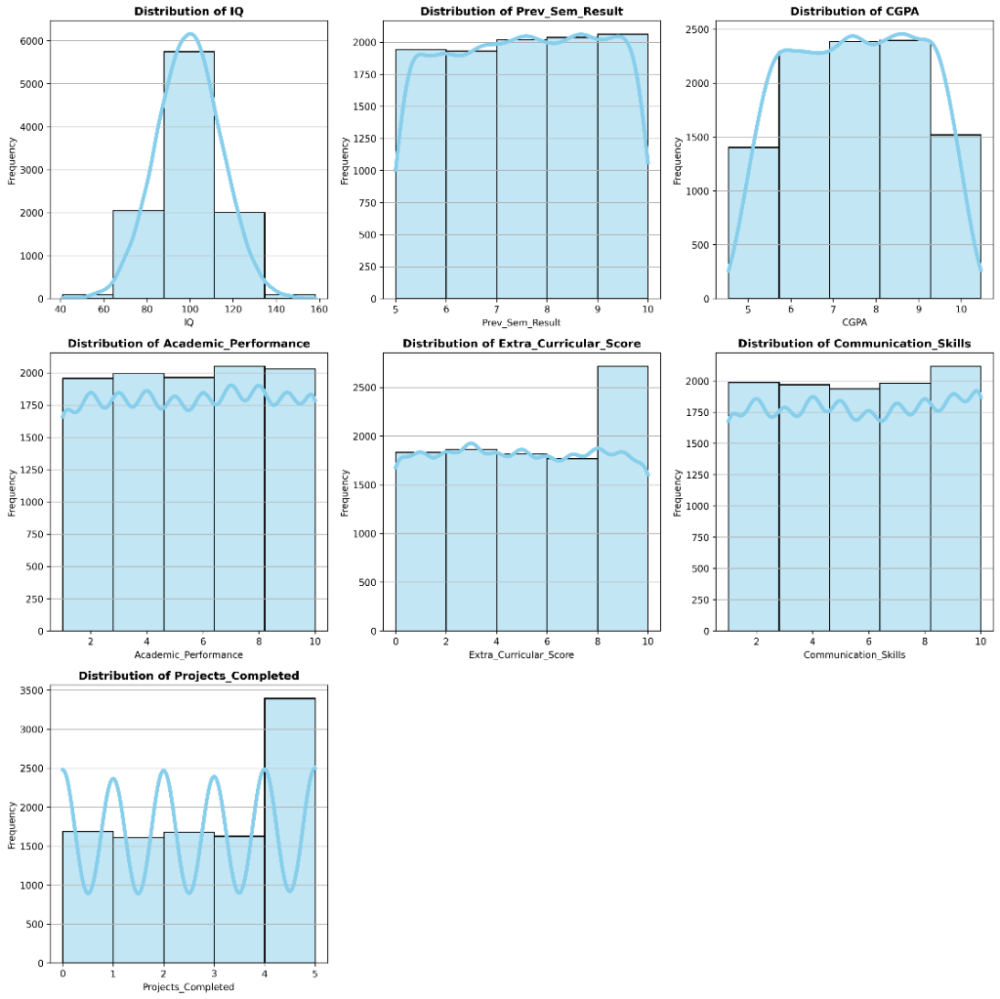
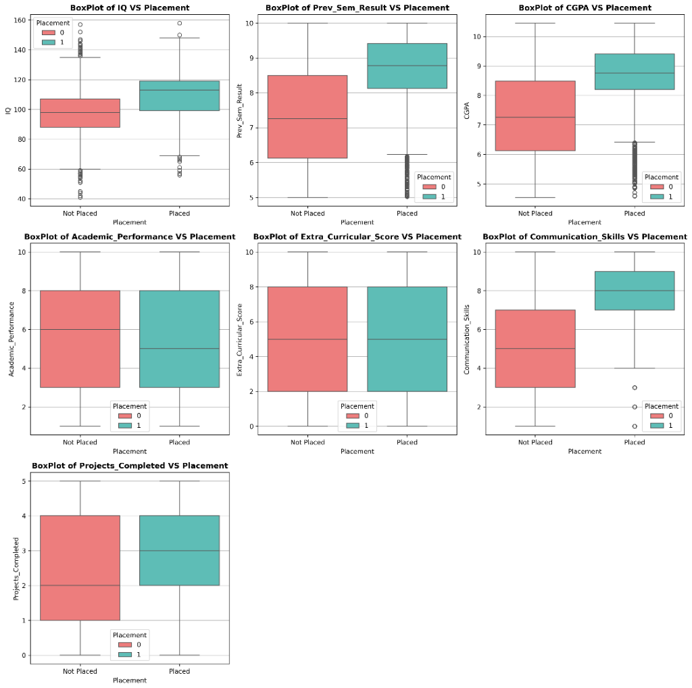
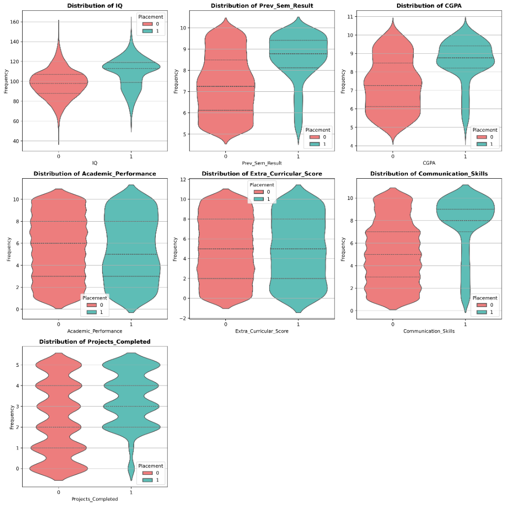

# 📊 Week 1 Report: Exploratory Data Analysis (EDA)

## Overview
This report documents the initial Exploratory Data Analysis performed on the College Student Placement Prediction dataset. The objective was to uncover patterns, understand feature distributions, and identify key factors influencing student placement.

## 1. Statistical Summary
The dataset consists of **10,000 student records**.

### Key Statistics
### Feature Statistics
| Feature | Count | Mean | Std Dev | Min | 25% | 50% (Median) | 75% | Max |
|---------|-------|------|---------|-----|-----|--------------|-----|-----|
| **IQ** | 10000 | 99.47 | 15.05 | 41.00 | 89.00 | 99.00 | 110.00 | 158.00 |
| **Prev Sem Result** | 10000 | 7.54 | 1.45 | 5.00 | 6.29 | 7.56 | 8.79 | 10.00 |
| **CGPA** | 10000 | 7.53 | 1.47 | 4.54 | 6.29 | 7.55 | 8.77 | 10.46 |
| **Academic Performance** | 10000 | 5.55 | 2.87 | 1.00 | 3.00 | 6.00 | 8.00 | 10.00 |
| **Internship Experience** | 10000 | 0.40 | 0.49 | 0.00 | 0.00 | 0.00 | 1.00 | 1.00 |
| **Extra Curricular Score** | 10000 | 4.97 | 3.16 | 0.00 | 2.00 | 5.00 | 8.00 | 10.00 |
| **Communication Skills** | 10000 | 5.56 | 2.90 | 1.00 | 3.00 | 6.00 | 8.00 | 10.00 |
| **Projects Completed** | 10000 | 2.51 | 1.72 | 0.00 | 1.00 | 3.00 | 4.00 | 5.00 |

*Note: The placement rate indicates a class imbalance (approx. 17% Placed vs 83% Not Placed).*

---

## 2. Univariate Analysis: Distributions
We analyzed the distribution of numerical features to understand their spread and central tendencies.

### Observations:
- **IQ**: Follows a near-normal distribution centered around 100.
- **CGPA & Previous Sem Results**: Show a relatively uniform or slightly skewed distribution, indicating a diverse range of academic performance among students.
- **Projects Completed**: Discrete distribution showing clusters of students completing between 0 to 5 projects.

---

## 3. Bivariate Analysis: Features vs. Placement
To understand what distinguishes placed students from those who weren't, we compared feature distributions across the two classes.

### Box Plots

### Violin Plots

### Key Insights:
- **CGPA**: There is a clear distinction. Placed students (Green/1) generally have a **higher median CGPA** compared to non-placed students. The box plot shows the interquartile range is shifted upwards.
- **Previous Semester Results**: Similar to CGPA, past performance is a strong differentiator.
- **Communication Skills**: Also shows a positive relationship with placement probability.
- **IQ**: While placed students tend to have higher IQs, there is significant overlap between the two groups, suggesting IQ alone isn't the sole decider.
- **Extra Curricular Score**: The distributions are almost identical for both groups, implying this feature has **little to no predictive power** for placement in this dataset.

---

## 4. Multivariate Analysis: Feature Correlations
We generated a heatmap to visualize the linear relationships between likelihood of placement and other features.

### Correlation Insights:
Features most strongly correlated with **Placement**:
1. **Communication Skills** ($r \approx 0.32$)
2. **CGPA** ($r \approx 0.32$)
3. **Previous Semester Result** ($r \approx 0.32$)
4. **IQ** ($r \approx 0.29$)
5. **Projects Completed** ($r \approx 0.22$)

**Features with weak/no correlation:**
- **Extra Curricular Score** ($r \approx -0.00$)
- **Academic Performance** ($r \approx -0.01$) (Surprisingly low, possibly due to definition or data nature)

**Multicollinearity:**
- We observe strong correlations between **CGPA** and **Previous Semester Results** ($r \approx 0.98$). This indicates multicollinearity, suggesting these two features provide very similar information. We might consider using only one of them or combining them for certain models to avoid redundancy.

---

## 5. Conclusion & Next Steps
### Conclusions
- **Academic Excellence Matters**: CGPA and Previous Semester Results are the most reliable indicators of placement.
- **Skills are Critical**: Communication skills and project completion are also significant drivers.
- **Redundancy**: The high correlation between academic features needs to be handled.
- **Irrelevant Features**: Extra-curricular scores seem irrelevant for this specific prediction task.

### Next Steps
1. **Data Preprocessing**:
   - Handle Multicollinearity (e.g., Drop `Prev_Sem_Result` or creating a composite `Academic_Score`).
   - Scale numerical features (StandardScaler) for distance-based algorithms.
2. **Handling Imbalance**: Use techniques like SMOTE or Class Weights in the model to address the 17% placement rate.
3. **Model Selection**: Start with **XGBoost** and **Random Forest** as they handle non-linear relationships and feature importance well.
